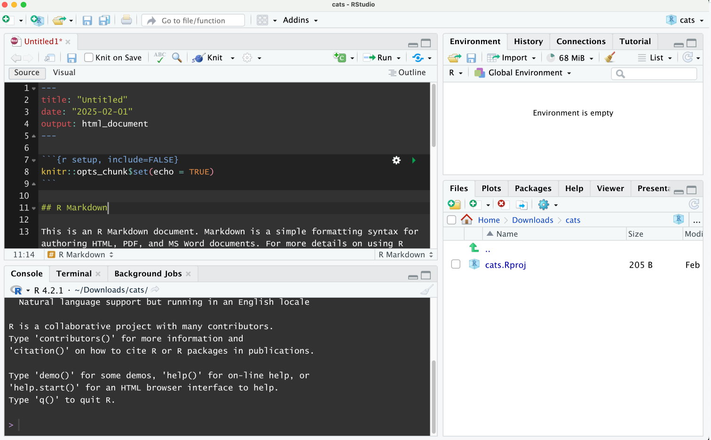

# rstudio_dark_light

Just a collection of dark&amp;light themes for Rstudio

For people who prefer dark panels just for code and console/terminal. Like this:

These themes uses the code provided here: https://github.com/rstudio/rstudio/issues/10754#issuecomment-1146613592 by @pieterprovoost

These themes are not official and may require some changes to work on a computer different than mine (Mac).

To use, just dowmload the file and add it to Rstudio (Tools > Global Options > Appearance > Add)